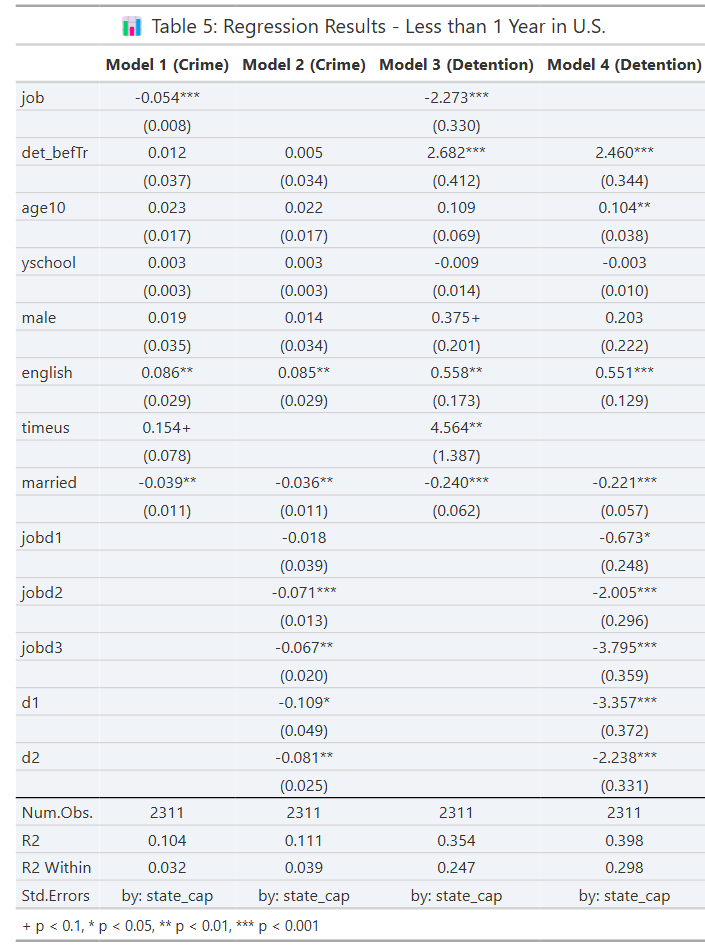
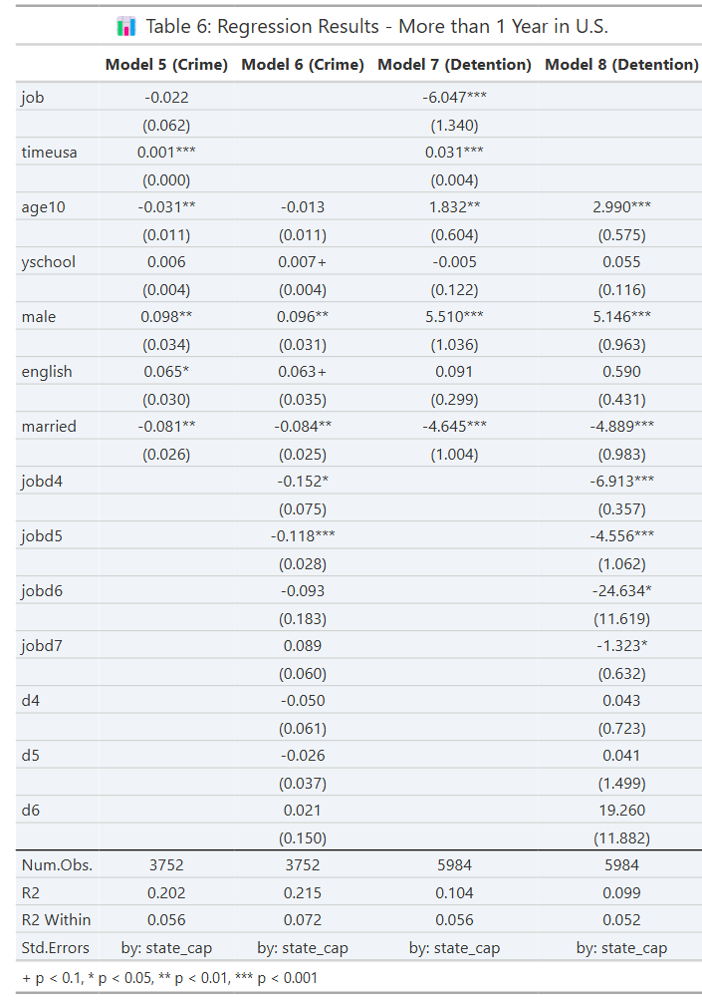

# 📊 Advanced Policy Research Methods - Final Project

## Overview
This project, titled **"Adv_Policy_Research_Mthds_Project_George_J"**, investigates the impact of employment status on crime and detention duration. The analysis utilizes fixed-effects regression models to control for individual characteristics and state-level factors.

## Data and Methodology
### Data Sources
The study uses three datasets:
- **AEA2020 T1 DATA**
- **AEA2020 T2 DATA1**
- **AEA2020 T2 DATA2**

The data is loaded in R using the `haven` package.

### Regression Models
The analysis applies fixed-effects regression (`feols` from `fixest` package) to estimate the effect of employment (`job`, `jobd1`, `jobd2`, etc.) on crime and time detained. The models include various demographic and economic control variables.

### Key Models:
1. **Crime models** (Models 1, 2, 5, and 6)
2. **Detention duration models** (Models 3, 4, 7, and 8)

### Clustering & Weights
- Standard errors are clustered at the **state capital level**.
- Observations are weighted using `weights`.

## Results

### Regression Output for Table 5
The table below presents the estimated coefficients for crime and detention models:

    

**Interpretation:**
- **Model 1 and Model 2**: Employment status and job type significantly affect crime rates. The models show that people with jobs have a lower probability of being involved in crime. However, job type has varying impacts.
- **Model 3 and Model 4**: Detention duration is influenced by employment status and job type. The coefficients suggest that individuals with certain jobs are detained for longer durations, while those without stable employment may experience shorter detentions.

### Regression Output for Table 6
The table below presents the estimated coefficients for crime and detention models:

    

**Interpretation:**
- **Model 5 and Model 6**: Similar to Table 5, the results for crime are driven by employment status. Those with jobs tend to have lower crime rates, and those with non-stable jobs are more likely to commit crimes.
- **Model 7 and Model 8**: The results suggest that people with certain jobs or no employment are detained for longer periods. The analysis provides important insights into how labor market conditions impact detention duration.

## Reproducibility
Code is provided to replicate my replication and clean any data errors noticed
